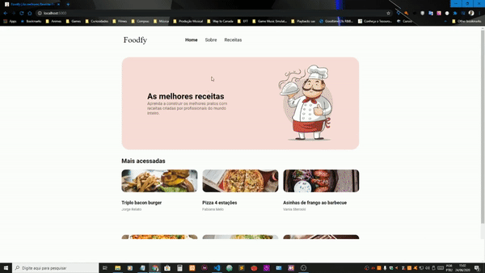
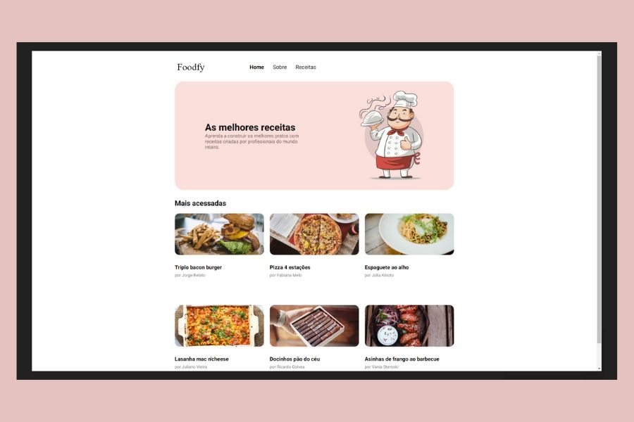

# Foodfy


<<<<<<< HEAD
## Preview:

=======
## Design preview:

>>>>>>> 6f62b8cee69fc6c906375d1b12060cd5dc1940b9

## Mobile


<<<<<<< HEAD


=======
>>>>>>> 6f62b8cee69fc6c906375d1b12060cd5dc1940b9

 Neste projeto, foram praticadas as mais variadas técnicas do Front End, irei listar algumas;


- Explorei o máximo do meu aprendizado em grid para listar as receitas,
 tornando assim o layout mais bonito.

 - Na página Receitas, ao clicar em uma das receitas, uma janela modal é aberta, apresentando 
    as características de cada item, porém de modo dinâmico. É aí que entra a melhor parte, o Javascript.

 - Foi explorado o evento de clique dentro do loop for, bem como uma array function, para abrir e fechar o modal.

- A parte mais desafiadora foi recuperar o texto na janela modal de modo dinâmico,
foram feitas várias tentativas até chegar nesta solução, que recupera o objeto diretamente como outer.HTML

### Code Preview:

```javascript
for (const card of cards) {
  card.addEventListener("click", () => {
    const recipe_id = card.getAttribute('id')
    const h3 = card.getElementsByTagName('h3')
    const p = card.getElementsByTagName('p')
    modalOverlay.classList.add('active');
    modalOverlay.querySelector('img').src = `assets/images/${recipe_id}.png`;
    modalOverlay.querySelector('h3').innerHTML = `${h3[0].outerHTML}`
    modalOverlay.querySelector('p').innerHTML = `${p[0].outerHTML}`

  })

}
```

# Atualização:

- Refatoração da página para o Back End.
- Utilização da Template Engine Nunjucks.
- Agora as informações são requisitadas no servidor.
- Criado uma nova página onde é detalhado as receitas.
- Retirado a função de modal para interação da página de receitas de forma dinâmica.
- Adicionado página "not-found", para status 404.


- Projeto compatível com vários dispositivos. 


